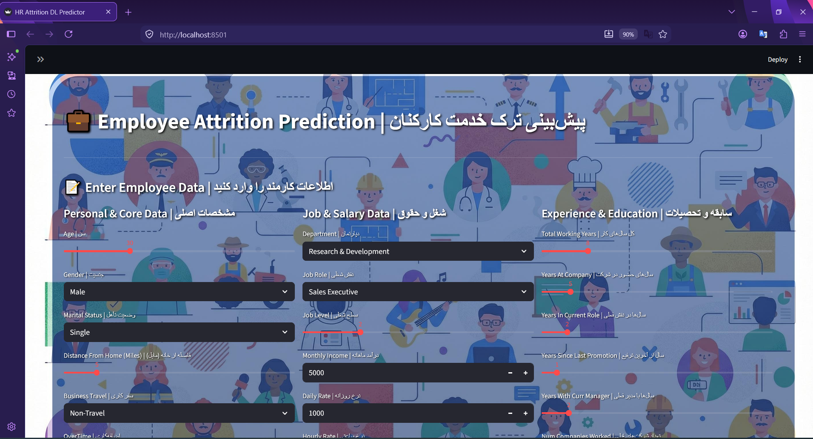
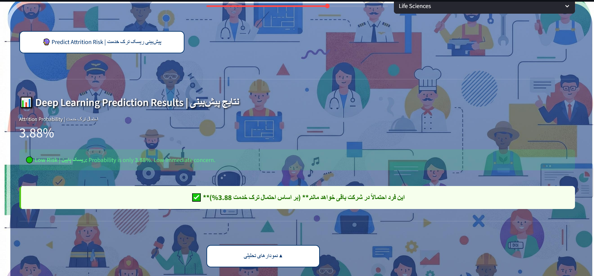
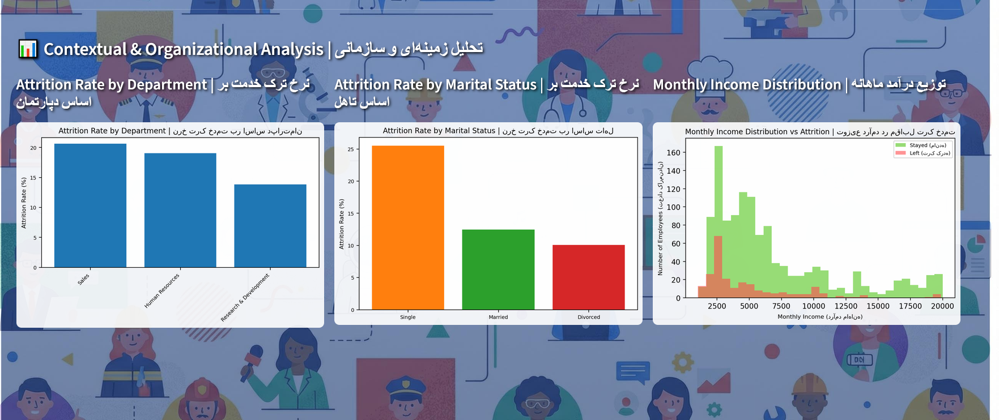

<div align="center">

# 💼 HR Attrition Prediction

### Employee Attrition Prediction using Deep Learning

[](https://www.python.org/)
[](https://www.tensorflow.org/)
[](https://streamlit.io/)
[](https://scikit-learn.org/)
[](LICENSE)

<br>

**A Deep Learning approach to predict employee attrition using the IBM HR Analytics dataset — with an interactive Streamlit dashboard and SHAP explainability.**

<br>

[📖 Overview](#-overview) · [📸 Screenshots](#-screenshots) · [🚀 Quick Start](#-quick-start) · [🧠 Model](#-model-architecture) · [📊 Results](#-results) · [👩‍💻 Author](#-author)

</div>

---

## 📖 Overview

Employee attrition is one of the most costly challenges for organizations. Losing a trained employee means recruitment costs, training time, and lost productivity. **This project predicts the probability of an employee leaving the company**, enabling HR teams to act *before* it's too late.

Trained on the well-known [IBM HR Analytics Attrition Dataset](https://www.kaggle.com/datasets/pavansubhasht/ibm-hr-analytics-attrition-dataset), this project combines:

- 🧠 **Deep Learning** — a regularized MLP built with TensorFlow/Keras
- 📊 **Interactive Dashboard** — a bilingual (English / Persian) Streamlit app
- 🔍 **Explainability** — SHAP values to understand *why* the model makes a prediction
- 📈 **Contextual EDA** — visual insights into attrition by department, marital status, and income distribution

---

## 📸 Screenshots

### 🎯 Prediction Dashboard
*Enter employee data and get an instant attrition risk score.*



### 📊 Prediction Result
*Real-time prediction with risk categorization (Low / Medium / High) and a summary message.*



### 📈 Contextual & Organizational Analysis
*EDA charts showing attrition patterns across departments, marital status, and income levels.*



---

## 🎯 Problem Statement

**Given:** A set of features describing an employee — personal, job-related, financial, and satisfaction data.

**Predict:** Whether this employee will leave the company (`Attrition`: Yes / No).

**Why it matters:** Attrition prediction enables HR teams to:

- Identify high-risk employees early
- Design targeted retention strategies
- Reduce recruitment and onboarding costs
- Improve overall employee satisfaction

---

## 🧠 Model Architecture

A fully-connected MLP with **L2 regularization** and **Dropout** to prevent overfitting:
┌──────────────────────────────┐
│ Input Layer (44 features) │
└──────────────┬───────────────┘
│
┌──────▼──────┐
│ Dense(256) │ ReLU + L2 + Dropout(0.4)
└──────┬──────┘
│
┌──────▼──────┐
│ Dense(128) │ ReLU + L2 + Dropout(0.3)
└──────┬──────┘
│
┌──────▼──────┐
│ Dense(64) │ ReLU
└──────┬──────┘
│
┌──────▼──────┐
│ Dense(32) │ ReLU
└──────┬──────┘
│
┌──────▼──────┐
│ Dense(1) │ Sigmoid → P(Attrition)
└─────────────┘


**Training configuration:**

| Parameter | Value |
| :--- | :--- |
| Optimizer | Adam (lr = 0.0005) |
| Loss | Binary Crossentropy |
| Batch Size | 32 |
| Epochs | up to 100 (EarlyStopping, patience = 20) |
| Regularization | L2 (0.001) + Dropout |
| Decision Threshold | **0.4** (tuned for minority-class recall) |

---

## 📊 Results

> The dataset is highly imbalanced (~16% attrition). We prioritize **recall on the minority class** over raw accuracy.

| Metric | Score |
| :--- | :---: |
| **AUC-ROC** | ~0.78 |
| Precision (Attrition = 1) | ~0.45 |
| Recall (Attrition = 1) | ~0.55 |
| F1-Score (Attrition = 1) | ~0.50 |

An AUC-ROC of ~0.78 means the model has good discriminative ability between employees who stay and those who leave.

---

## 🚀 Quick Start

### 1️⃣ Clone the repository

```bash
git clone https://github.com/ahlam-ghasemiyan/hr-attrition-prediction.git
cd hr-attrition-prediction
2️⃣ Install dependencies
bash
pip install -r requirements.txt
3️⃣ Train the model
bash
python Hr_dp.py
This will generate:

professional_attrition_dl_model.h5 — trained model

scaler.pkl, model_columns.pkl, numerical_cols.pkl — preprocessing artifacts

X_train_sample_scaled.npy — background sample for SHAP

4️⃣ Run the Streamlit app
bash
streamlit run streamlit_app.py
Open your browser at http://localhost:8501 ✨

📁 Project Structure
text
hr-attrition-prediction/
├── Hr_dp.py                                  # 🧠 Model training
├── HR_data.py                                # 🔧 Data preprocessing
├── streamlit_app.py                          # 📊 Streamlit dashboard
├── WA_Fn-UseC_-HR-Employee-Attrition.csv     # 📂 Dataset
├── requirements.txt                          # 📦 Dependencies
├── LICENSE                                   # ⚖️ MIT License
├── .gitignore
├── README.md
└── assets/                                   # 🖼️ Screenshots & background
    ├── hr.jpg
    ├── screenshot-dashboard.png
    ├── screenshot-prediction.png
    └── screenshot-charts.png
🔮 Future Work
□ 📈 Hyperparameter tuning with Optuna
□ ⚔️ Benchmark against XGBoost and LightGBM
□ 🌐 Deploy on Streamlit Cloud / Hugging Face Spaces
□ 🧪 Add unit tests with pytest
□ ⚙️ CI/CD pipeline with GitHub Actions
□ 🐳 Docker support for reproducibility
□ 🚀 REST API with FastAPI for integrations
□ 📉 Focal Loss to better handle class imbalance
📜 Dataset
Source: IBM HR Analytics Employee Attrition & Performance

Size: 1,470 rows × 35 features

Target variable: Attrition (Yes / No)

Class balance: ~16% attrition (imbalanced)

👩‍💻 Author
<div align="center">
Ahlam Ghasemiyan
https://github.com/ahlam-ghasemiyan
</div>
📄 License
This project is licensed under the MIT License — see the LICENSE file for details.

You are free to:

✅ Use commercially

✅ Modify

✅ Distribute

✅ Use privately

Just include the original copyright notice.

<div align="center">
⭐ If this project helped you, please give it a star!
Made with ❤️ by Ahlam Ghasemiyan

</div> ```
